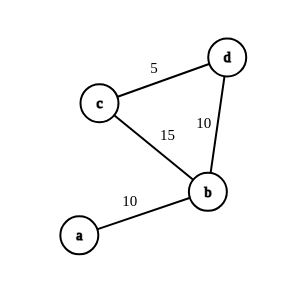
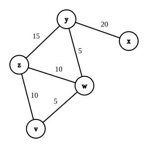
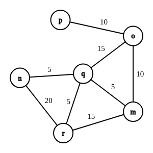

<section>

        

    

GCC128 - Inteligência Artificial - 2023/1

    

Professor: Eric Fernandes de Mello Araújo

Aluno: Victor Gonçalves Lima

Matrícula: 202020775

Turma: 10A

        

</section>

# Labirinto

Trabalho desenvolvido para a disciplina de Inteligência Artificial da Universidade Federal de Lavras no Bacharelado em Ciência da Computação.

O trabalho consiste em desenvolver um programa em Prolog aplicando conceitos de Sistema Especialista, capaz de encontrar um caminho através de um labirinto, representado por um grafo conexo e não direcionado.

## Conteúdo

- <a href="#1">1. Banco de Dados (Fatos)</a>
- <a href="#2">2. Regras</a>
  - <a href="#2.1">2.1. Way</a>
  - <a href="#2.2">2.2. Solve</a>
    - <a href="#2.2.1">2.2.1. Solve (sem ordenação dos melhores caminhos)</a>
    - <a href="#2.2.2">2.2.2. Solve (com ordenação dos melhores caminhos)</a>
  - <a href="#2.3">2.3. Depth-First Search</a>
- <a href="#3">3. Exemplos</a>
  - <a href="#3.1">3.1. Exemplo 1</a>
  - <a href="#3.2">3.2. Exemplo 2</a>
  - <a href="#3.3">3.3. Exemplo 3</a>
- <a href="#4">4. Conclusão</a>
- <a href="#5">Referências</a>

## Ambiente

**Observação:** Testado com *swi-prolog* em Linux.

### Instalação do Prolog (Linux)

    sudo apt-add-repository ppa:swi-prolog/stable
    sudo apt-get update
    sudo apt-get install swi-prolog

### Execução

- Abrir o swipl:

      cd labirinto/ && swipl

- Carregar as regras:

      consult("regras.pl").

- Carregar o banco de dados:

      consult("fatos.pl").

- Recarregar o banco de dados:

      reconsult("fatos.pl").

# <a id="1">1. Banco de Dados (Fatos)</a>

Está disponível no arquivo `fatos.pl`.

O banco de dados é constituído de fatos no seguinte formato:
`pway(a, b, x)` indicando que há uma passagem da interseção `a`
para a interseção `b` com comprimento de `x` metros.

# 2. <a id="2">Regras</a>

Estão disponíveis no arquivo `regras.pl`.

## <a id="2.1">2.1. Way</a>

`way(X, Y, N)` garante que, se `X` chega a `Y` com uma distância `N`,
`Y` chega a `X` com a mesma distância `N`.

    way(X, Y, N) :-
        pway(X, Y, N); pway(Y, X, N).

## <a id="2.2">2.2. Solve</a>

`solve(X, Y, P, N)` que encontrará um caminho `P` de comprimento `N`
(se existir) da interseção `X` para a interseção `Y`. A intenção é que o
usuário invoque solve como uma consulta, especificando `X` e `Y` como
constantes e `P` e `N` como variáveis.

### <a id="2.2.1">2.2.1. Solve (sem ordenação dos melhores caminhos)</a>

A consulta chamará um algoritmo de busca em largura (*depth-first search*) `dfs(X, Y, [X], P, 0, N)`, iniciando a lista com o ponto de partida `[X]` e com distância percorrida `0`.

Caso a busca em largura retorne `false`, será imprimido `"no"`.

    solve(X, Y, P, N) :-
        dfs(X, Y, [X], P, 0, N); write("no").

**Observação:** Esta regra foi comentada no código fonte para ser utilizada a regra a seguir, com ordenação dos resultados.

### <a id="2.2.2">2.2.2. Solve (com ordenação dos melhores caminhos)</a>

De forma semelhante a consulta padão, sem ordenação dos resultados, a consulta rá chamar o algoritmo de busca em largura `dfs(X, Y, [X], P, 0, N)` e irá armazenar todos os resultados em ma lista de tuplas `A`, onde o primeiro elemento de cada tupla `M` será a distância percorrida e o segundo elemento `Q` será a lista de interseções percorridas. Isso é possível através da chamada da regra `findall` da linguagem.

Em seguida, a lista `A` é ordenada pelo valor do primeiro elemento de cada tupla (a distância percorrida), gerando a lista de resultados ordenados `B`.

E por fim, os resultados são extraídos da lista na forma `P` e `N`, retornando os valores das variáveis especificadas.

    solve(X, Y, P, N) :-
      findall([M, Q], dfs(X, Y, [X], Q, 0, M), A),
      sort(A, B),
      member([P, N], B); write("no").

## <a id="2.3">2.3. Depth-First Search</a>

Algoritmo de busca em largura que computa as soluções de forma recursiva.

- Caso base: `dfs(X, X, P, P, N, N)`

  Quando `X` é igual a `Y`, não existe mais caminhos para percorrer, o caminho `P` é definido, assim como a distância percorrida `N`.

- Caso recursivo: `dfs(X, Y, V, P, M, N)`

  Realiza a busca por caminhos:

  - `way(X, Z, A)`: verifica se `Z` possui caminho para `X`.

  - `\+ member(Z, V)`: verifica se `Z` ainda não foi visitado;

  - `append(V, [Z], W)`: adiciona `Z` aos visitados;

  - `B is M + A`: soma o caminho percorrido;

  - `dfs(Z, Y, W, P, B, N)`: continua a busca a partir de `Z`.

    dfs(X, X, P, P, N, N).
    dfs(X, Y, V, P, M, N) :-
        way(X, Z, A),
        \+ member(Z, V),
        append(V, [Z], W),
        B is M + A,
        dfs(Z, Y, W, P, B, N).

# <a id="3">3. Exemplos</a>

## <a id="3.1">3.1. Exemplo 1</a>

- Banco de dados:

      pway(a, b, 10).
      pway(b, c, 15).
      pway(d, c, 5).
      pway(d, b, 10).

- Chamada:

      solve(a, d, P, N).

- Saída esperada:

      P = [a, b, d],
      N = 20 ;
      P = [a, b, c, d],
      N = 30 ;
      no

## <a id="3.2">3.2. Exemplo 2</a>

- Banco de dados:

      pway(x, y, 20).
      pway(y, z, 15).
      pway(w, z, 10).
      pway(w, y, 5).
      pway(v, z, 10).
      pway(v, w, 5).

- Chamada:

      solve(v, x, P, N).

- Saída esperada:

      P = [v, w, y, x],
      N = 30 ;
      P = [v, z, w, y, x],
      N = 45 ;
      P = [v, z, y, x],
      N = 45 ;
      P = [v, w, z, y, x],
      N = 50 ;
      no

## <a id="3.3">3.3. Exemplo 3</a>

- Banco de dados:

      pway(m, o, 10).
      pway(m, q, 5).
      pway(m, r, 15).
      pway(n, q, 5).
      pway(n, r, 20).
      pway(o, p, 10).
      pway(o, q, 15).
      pway(q, r, 5).

- Chamada:

      solve(r, p, P, N).

- Saída esperada:

      P = [r, q, m, o, p],
      N = 30 ;
      P = [r, q, o, p],
      N = 30 ;
      P = [r, m, o, p],
      N = 35 ;
      P = [r, m, q, o, p],
      N = 45 ;
      P = [r, n, q, m, o, p],
      N = 50 ;
      P = [r, n, q, o, p],
      N = 50 ;
      no

# <a id="4">4. Conclusão</a>

O algoritmo proposto implementa uma busca em profundidade em um grafo para encontrar um caminho válido entre dois pontos de um labirinto. A busca não necessariamente encontrará o caminho mais curto em sua primeira chamada, uma vez que um critério (como o caminho de menor custo) para ir ao próximo ponto não foi definido dentro da implementação, mas retornará por força bruta todos os caminhos possíveis.

Dessa forma, a acurácia dos resultados obtidos dependerá da corretude das regras definidas. Se as regras estiverem corretas e todas as conexões e custos estiverem definidos de forma precisa, a busca em profundidade retornará um ou mais caminhos válido de `X` para `Y`, quando existir tais caminhos no grafo.

# <a id="5">Referências</a>

- Merritt, Dennis. Building Expert Systems in Prolog. Springer, 1989.

- Wikipedia. Depth-first search. Disponível em: https://en.wikipedia.org/wiki/Depth-first_search. Acesso em: 4 jun. 2023.

